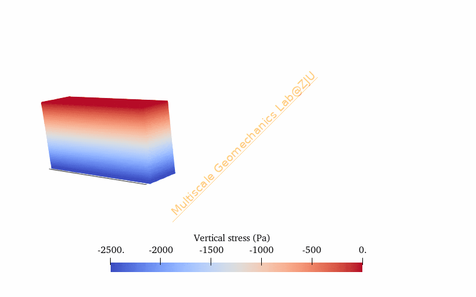
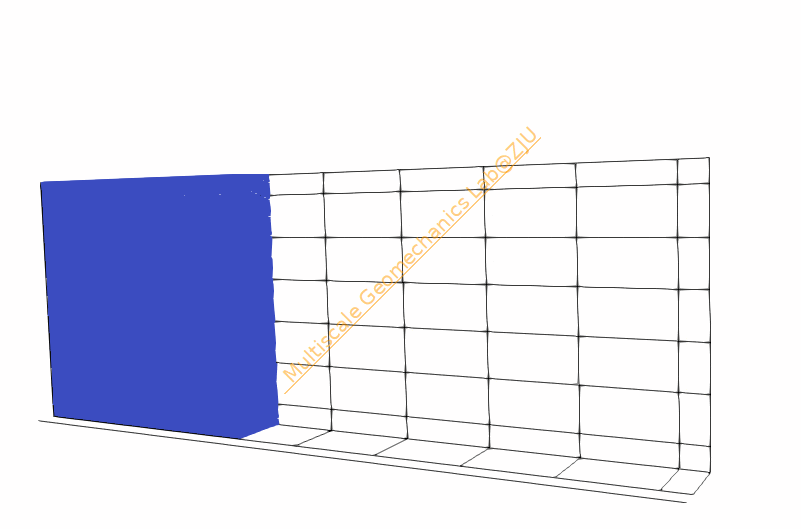
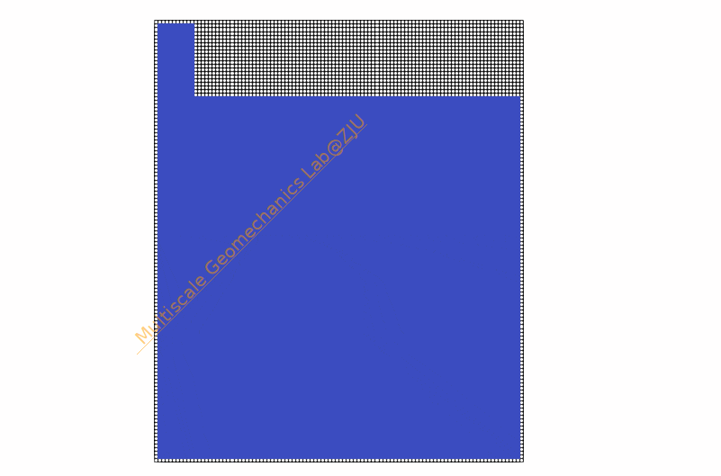
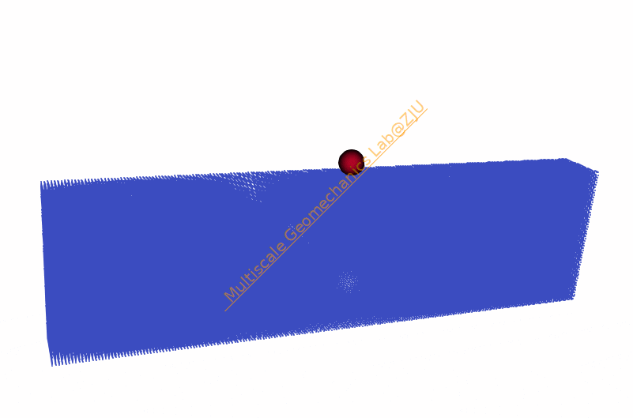
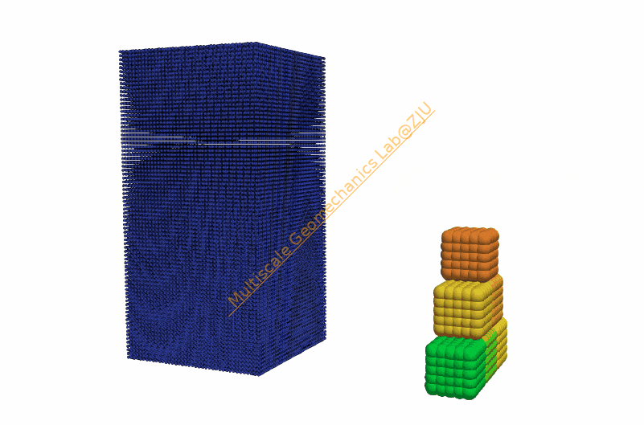

# GeoTaichi

                             [](http://makeapullrequest.com) 

[**Quick start**](#quick-start) | [**Examples**](#examples) | [**Paper**](https://www.researchgate.net/publication/380048019_GeoTaichi_A_Taichi-powered_high-performance_numerical_simulator_for_multiscale_geophysical_problems) | [**Citation**](#citation) | [**Contact**](#acknowledgements)

## Brief description

A [Taichi](https://github.com/taichi-dev/taichi)-based numerical package for high-performance simulations of multiscale and multiphysics geophysical problems. 
Developed by [Multiscale Geomechanics Lab](https://person.zju.edu.cn/en/nguo), Zhejiang University.

<p align="center">
    
</p>


## Overview

GeoTaichi is a collection of several numerical tools, currently including __Discrete Element Method (DEM)__, __Material Point Method (MPM)__, __Material Point-Discrete element method (MPDEM)__, and __Finite Element Method (FEM)__, that cover the analysis of the __Soil-Gravel-Structure-Interaction__ in geotechnical engineering. The main components of GeoTaichi is illustrated as follows:
<p align="center">
    
</p>

GeoTaichi is a research project that is currently __under development__. Our vision is to share with the geotechnical community a free, open-source (under the GPL-3.0 License) software that facilitates the relevant computational research. In the Taichi ecosystem, we hope to emphasize the potential of Taichi for scientific computing. Furthermore, GeoTaichi is high parallelized, multi-platform (supporting for Windows, Linux and Macs) and multi-architecture (supporting for both CPU and GPU).

## Examples

Have a cool example? Submit a PR!

### Material point method (MPM)
| [Column collapse](example/mpm/ColumnCollapse/DPmaterial.py) | [Dam break](example/mpm/ColumnCollapse/NewtonianFluid.py) | [Strip footing](example/mpm/Footing/StripFootingTresca.py) |
| --- | --- | --- |
|  |  |  |

### Discrete element method (DEM)
| [Granular packing](example/dem/GranularPackings/clumps_packing.py) | [Heap formation](example/dem/HeapFormation/sphere_packing.py) | [Triaxial shear test](example/dem/TriaxialTest/drained.py) |
| --- | --- | --- | 
|  |  |  |


The performance of GeoTaichi is compared with similar simulator in the field, such as [MUSEN](https://msolids.net/musen/) and [CoSim](http://www.meggs.hydr.tsinghua.edu.cn/index.html), showing a notable improvement in both computational efficiency and memory usage.

### Coupled material point-discrete element method (MPDEM)
| [A sphere impacting granular bed](example/dempm/SphereImpact/plane_strain.py) | [Granular column impacting cubic particles](example/dempm/GranularImpact/granular_impact.py) |
| --- | --- |
|  |  |

## Quick start
### Dependencies

- Python packages

|Package name|Version|Features|
|:----------:|:-----:|:------:|
|[python](https://www.python.org/)|>=3.8|Programming language|
|[psutil](https://pypi.org/project/psutil/)|lastest|Get GPU memory|
|[taichi](https://pypi.org/project/taichi/)|==1.6.0|High performance computing|
|[numpy](https://pypi.org/project/numpy/)|==1.23.5|Pre-processing|
|[scipy](https://pypi.org/project/SciPy/)|==1.10.1|Pre-processing|
|[pybind11](https://pypi.org/project/pybind11/)|==2.10.4|Warp C++ code|
|[trimesh](https://pypi.org/project/trimesh/)|==3.20.1|Import stl/obj files|
|[shapely](https://pypi.org/project/shapely/)|==1.8.0|Delaunay triangulation|

### Installation

1. Change the current working directory to the desired location and download the GeoTaichi code:
```
cd /path/to/desired/location/
git clone https://github.com/Yihao-Shi/GeoTaichi
cd GeoTaichi
```
2. Install essential dependencies
```
# Install python and pip
sudo apt-get install python3.8
sudo apt-get install python3-pip

# Install python packages (recommand to add package version)
python3 -m pip install taichi==1.6.0 imageio pybind11 numpy trimesh psutil shapely [optional: -i https://pypi.douban.com/simple]

# Install Eigen in C++ (if necessary)
sudo apt-get install libeigen3-dev cmake==3.18.2

# Install pybind11 (if necessary)
git clone https://github.com/pybind/pybind11.git
cd  pybind11
mkdir build
cd build
cmake ..
make check -j 4 
sudo make install
```
3. Install CUDA, detailed information can be referred to [official installation guide](https://docs.nvidia.com/cuda/cuda-installation-guide-linux/index.html)
4. Set up environment variables
```
sudo gedit ~/.bashrc
$ export PYTHONPATH="$PYTHONPATH:/path/to/desired/location/GeoTaichi"
source ~/.bashrc
```

### Working with vtu files

To visualize the VTS files produced by some of the scripts, it is recommended to use Paraview. It can be
freely downloaded from: http://www.paraview.org/ To visualize the output in ParaView, use the following
procedure:
1. Open the .vts or .vtu file in ParaView
2. Click on the "Apply" button on the left side of the screen
3. Make sure under "Representation" that "Surface" or "Surface with Edges" is selected
4. Under "Coloring" select variables and the approriate measure (i.e. "Magnitude", X-direction displacement, etc.)

### Document

Currently, only the tutorial of DEM in Chinese version is available in [doc](https://github.com/Yihao-Shi/GeoTaichi/blob/main/docs/GeoTaichi_tutorial_DEM_Chinese_version.pdf). 
Users can set up simulations by specifying numerical parameters and configuring the desired simulation settings in a Python script. More detailed about Python scripts can be found in the [example floder](https://github.com/Yihao-Shi/GeoTaichi/tree/main/example).

## Features
### Discrete Element Method 
Discrete element method is a powerful tool to simulate the movement of granular materials through a series of calculations that trace individual particles constituting the granular material.
  - Sphere and multisphere particles
  - Generating particle packings by specifying initial void ratio or particle number in a box/cylinder/sphere/triangular prism
  - Two neighbor search algorithms, brust search/linked-cell
  - Two velocity updating schemes, symlectic Euler/velocity Verlet
  - Three contact models, including linear elastic, hertz-mindlin and linear rolling
  - Supporting plane (infinite plane)/facet (servo wall)/triangle patch (suitable for complex boundary condition)

### Material Point Method 
The material point method (MPM) is a numerical technique used to simulate the behavior of solids, liquids, gases, and any other continuum material. Unlike other mesh-based methods like the finite element method, MPM does not encounter the drawbacks of mesh-based methods (high deformation tangling, advection errors etc.) which makes it a promising and powerful tool in computational mechanics. 
  - Nine Constitutive Models, including linear elastic/neo-hookean/Von-Mises/isotropic hardening plastic/Mohr-Coulomb/Drucker-Prager/(cohesive) modified cam-clay/Newtonian fluid/Bingham fluid
  - Two improved velocity projection techniques, including MLS/APIC
  - Three stress update schemes, including USF/USL/MUSL/APIC
  - Three stabilization techniques, including mix integration/B-bar method/F-bar method
  - Two smoothing mehod, including strain/stress smoothing
  - Supporting Dirichlet (Fix/Reflect/Friction)/Neumann boundary conditions
  - Supporting total/updating Lagrangian explicit MPM and implicit MPM (Newmark-$\beta$ method)
  - Free surface detection

### MPDEM coupling
  - Two contact models, including linear elastic, hertz-mindlin
  - Support DEM-MPM-Mesh contact, feasible simulating complex boundary conditions 
  - Multilevel neighbor search
  - Two way or one way coupling

### Postprocessing
  - Restart from a specific time step
  - A simple GUI powered by [Taichi](https://github.com/taichi-dev/taichi)
  - VTU([Paraview](http://www.paraview.org/)) and NPZ(binary files) files are generated in the process of simualtion
  - Supporting force chain visualization

## Under development
  - Developing level set DEM modules
  - Developing a well-structured IGA modules
  - Optimizing code structures
  - Simulating soil-gravel-structure problems in geotechnical engineering
  
## License
This project is licensed under the GNU General Public License v3 - see the [LICENSE](https://www.gnu.org/licenses/) for details.

## Citation
Please kindly star :star: this project if it helps you. We take great efforts to develope and maintain it :grin::grin:.

If you publish work that makes use of GeoTaichi, we would appreciate if you would cite the following reference:
```latex
@article{shi2024geotai,
  author    = {Y. H. Shi, N. Guo., Z. X. Yang},
  title     = {GeoTaichi: a Taichi-powered high-performance numerical simulator for multiscale geophysical problems},
  year      = {2024},
  journal   = {Computer Physics Communications},
  pages     = {109219},
  publisher = {Elsevier},
  doi       = {https://doi.org/10.1016/j.cpc.2024.109219}
}
```

## Acknowledgements
We thank all amazing contributors for their great work and open source spirit. We welcome all kinds of contributions to file an issue at [GitHub Issues](https://github.com/Yihao-Shi/GeoTaichi/issues).

### Contributors
<a href="https://github.com/Yihao-Shi/GeoTaichi/graphs/contributors">
  
</a>

### Contact us
- If you spot any issue or need any help, please mail directly to <a href = "mailto:shiyh26@zju.edu.cn">shiyh26@zju.edu.cn</a>.

## Release Notes
V0.1 (January 21, 2024)

- First release GeoTaichi
