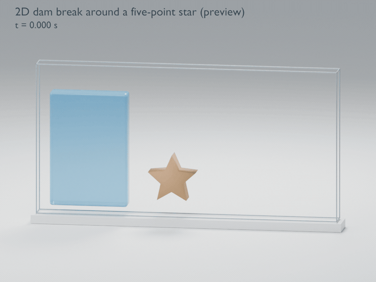
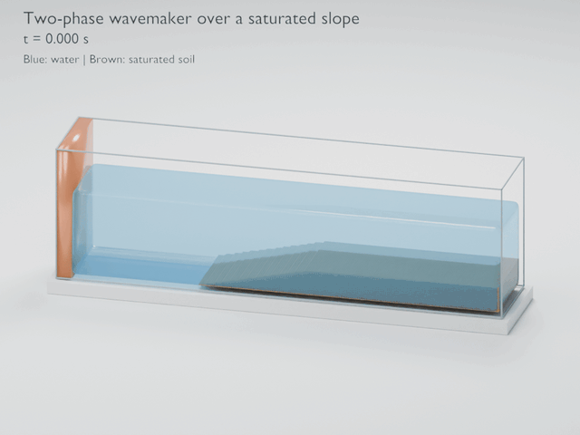
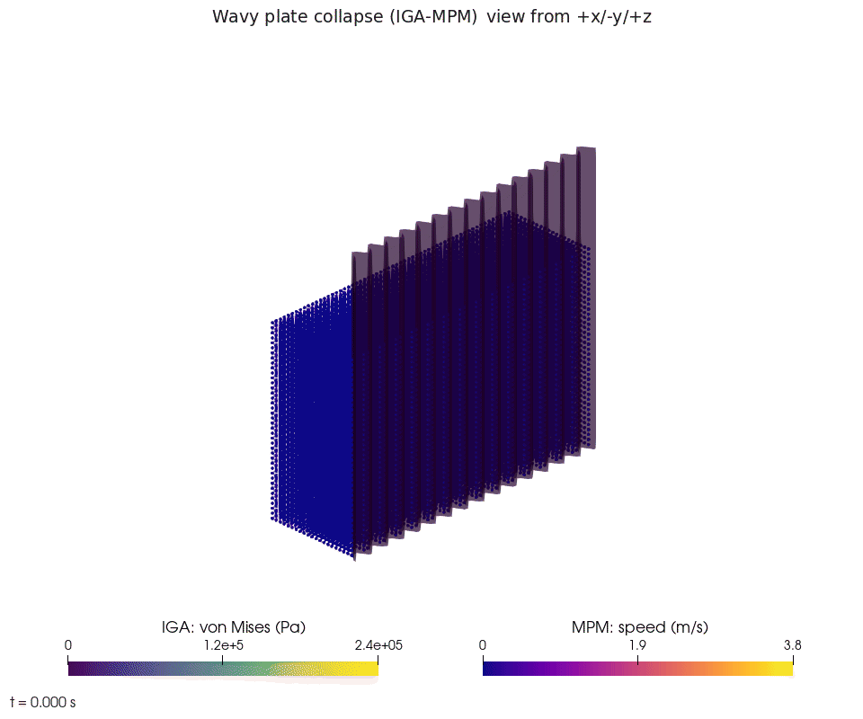

# GeoTaichi

                             [](http://makeapullrequest.com) 

[**Quick start**](#quick-start) | [**Capabilities**](#core-capabilities) | [**Coupling formulations**](#featured-coupling-formulations) | [**Examples**](#examples) | [**Documentation**](#documentation) | [**Citation**](#citation) | [**Contact**](#contact-us)

## Brief description

GeoTaichi is an open-source, [Taichi](https://github.com/taichi-dev/taichi)-powered simulation framework for granular materials, deformable solids, incompressible fluids, and coupled soil–water–structure interaction. It combines the material point method (MPM), discrete element method (DEM), level-set DEM (LSDEM), affine body dynamics (ABD), finite element method (FEM), and isogeometric analysis (IGA) with explicit, semi-implicit, and implicit solver routes.

Developed by [Multiscale Geomechanics Lab](https://person.zju.edu.cn/en/nguo), Zhejiang University.

<p align="center">
    
</p>


## Overview

GeoTaichi targets multiscale and multiphysics geomechanics: large-deformation and elastoplastic solids, arbitrarily shaped grains, free-surface flow, saturated porous media, and contact with deformable or nearly rigid structures. Solver modules can be used independently or combined through explicit contact exchange, immersed boundary methods (IBM), or fully coupled incremental potential contact (IPC).

GeoTaichi is an actively developed research project released under GPL-3.0. Taichi provides parallel CPU and GPU execution on supported Windows, Linux, and macOS configurations. Backend, precision, dimensionality, and material support depend on the selected solver; the module READMEs document these restrictions. A feature available in one solver route should not be assumed to be available in every route.

## Examples

Have an example to share? Submit a [PR](https://github.com/Yihao-Shi/GeoTaichi/pulls)!

### [Material point method (MPM)](src/mpm/README.md#mpm-theory-log)
#### Explicit MPM
| [Column collapse](examples/mpm/column_collapse/DPmaterial.py) | [Dam break](examples/mpm/column_collapse/NewtonianFluid.py) | [Strip footing](examples/mpm/Footing2D/FootingTrescaLargeBBar.py) | [Progressive failure process of sensitive clay](examples/mpm/column_collapse2D/SoftDP.py) |
| --- | --- | --- | --- |
|  |  |  |  |

#### Semi-implicit incompressible MPM

| [Flow around a cylinder](examples/cfdem/FullyResolved/IBMFixedCylinder2D/cylinder_flow_ibm_2d.py) | [Lid-driven cavity (n64)](examples/mpm/IncompressibleFluid/lid_driven_cavity_2d/lid_driven_cavity_2d.py) | [Taylor–Green vortex](examples/mpm/IncompressibleFluid/taylor_green_vortex_2d/taylor_green_vortex_2d.py) |
| --- | --- | --- |
|  |  |  |

| [Dam break around a five-point star](examples/mpm/IncompressibleFluid/dam_break_visible_sdf_2d/dam_break_visible_sdf_2d.py) | [3D large-tank dam break](examples/mpm/IncompressibleFluid/large_tank_incompressible_3d/large_tank_incompressible_3d.py) | [3D piston wavemaker](examples/mpm/IncompressibleFluid/wavemaker_tank_3d/wavemaker_tank_3d.py) |
| --- | --- | --- |
|  |  |  |

#### Two-phase semi-implicit MPM

| [Dam break through a porous column](examples/mmpm/DamBreakPorousElastic2D/double_point_dam_break_porous_elastic.py) | [Submarine granular landslide](examples/mmpm/SubmarineLandslide/submarine_landslide_2d/submarine_landslide_2d.py) | [U-tube flow through a porous bed](examples/mmpm/UTubeFlow2D/u_tube_flow_2d.py) | [3D two-phase wavemaker](examples/mmpm/TwoPhaseWavemaker3D/two_layer_two_phase_wavemaker_3d.py) |
| --- | --- | --- | --- |
|  |  |  |  |

### [Discrete element method (DEM)](src/dem/README.md#dem-theory-log)
#### Explicit soft constraint
| [Granular packing](examples/dem/LevelSet/GranularAssemble/polydisperse/packing_generate.py) | [Screw and nut](examples/dem/LevelSet/ParticleParticle/screw_and_nut.py) | [Debris flow](examples/dem/LevelSet/DebrisFlow/) |
| --- | --- | --- | 
|  |  |  | 

| [Rotating drum](examples/dem/LevelSet/RotatingDrum/rotating_drum.py) | [Triaxial shear test](examples/dem/LevelSet/TriaxialShear/) |
| --- | --- | 
|  |  |
#### Implicit affine body dynamics (ABD)

Implemented examples include [sphere–wall collision](examples/dem/AffineBody/sphere_wall_collision/sphere_wall_collision.py), [cube sliding](examples/dem/AffineBody/cube_incline_sliding/cube_incline_sliding.py), and a [multilink arm](examples/dem/AffineBody/robot_multilink_arm/robot_multilink_arm.py). See the [ABD mechanics and IPC derivation](src/dem/README.md#5-affine-body-mechanics-and-ipc).

### [FEM](src/fem/README.md#fem-theory-log) / [IGA](src/iga/README.md#iga-theory-log)

Implemented examples include an [implicit FEM cantilever](examples/fem/implicit_volume_cantilever/implicit_volume_cantilever.py), [cloth contact](examples/fem/implicit_cloth_contact/implicit_cloth_contact.py), an [IGA elastic beam](examples/iga/elastic_beam2d/elastic_beam2d.py).

### [FEM-MPM](src/fempm/README.md#fem--mpm-coupling-theory-log) / [IGA-MPM](src/igampm/README.md#iga--mpm-coupling-theory-log)
#### Explicit soft constraint

See the implemented [FEM–MPM membrane contact](examples/fempm/explicit_point_membrane/explicit_point_membrane.py) and [IGA–MPM contact](examples/igampm/iga_mpm_explicit_dem_contact/iga_mpm_explicit_dem_contact.py) examples.

#### Incremental potential contact
| Flexible barrier ([FEM–MPM](examples/fempm/flexible_barrier/flexible_barrier.py), [IGA–MPM](examples/igampm/flexible_barrier/flexible_barrier.py))| Wavy plate collapse ([FEM–MPM](examples/fempm/wavy_plate_collapse/wavy_plate_collapse.py), [IGA–MPM](examples/igampm/wavy_plate_collapse/wavy_plate_collapse.py)) | Axisymmetric CPT ([FEM–MPM](examples/fempm/cpt_dp/cpt_dp.py), [IGA–MPM](examples/igampm/cpt_dp/cpt_dp.py)) |
| --- | --- | --- |
| |  | |

### [FEM-DEM](src/fedem/README.md#fedem-coupling-theory-log)
#### Explicit soft constraint

<table width="100%">
  <thead>
    <tr>
      <th width="33.33%" align="center"><a href="examples/fedem/HertzContact/hertz_contact.py">Hertz contact</a></th>
      <th width="33.33%" align="center"><a href="examples/fedem/MixedFunnel/mixed_funnel.py">Mixed funnel</a></th>
      <th width="33.33%" align="center"><a href="examples/fedem/IsotropicCompaction/isotropic_compaction.py">Isotropic compaction</a></th>
    </tr>
  </thead>
  <tbody>
    <tr>
      <td width="33.33%" align="center"></td>
      <td width="33.33%" align="center"></td>
      <td width="33.33%" align="center"></td>
    </tr>
  </tbody>
</table>

#### Incremental potential contact

Fully coupled FEM–ABD IPC is implemented; see the [soft-particle example](examples/fedem/ImplicitAffineIPCSoftParticle/implicit_affine_ipc_soft_particle.py).

### [MPM-DEM](src/mpdem/README.md#mpdem-theory-log)
#### Explicit MPM-DEM
| [A sphere impacting granular bed](examples/mpdem/MultiSphere/SphereImpactToGranularBed/plane_strain.py) | [Granular column impacting cubic particles](examples/mpdem/MultiSphere/GranularImpact/granular_impact.py) | [Box sinking into water](examples/mpdem/LevelSet/WaterImpact/box.py) |
| --- | --- | --- |
|  |  |  |

#### Immersed boundary method

| [Drafting, kissing and tumbling](examples/cfdem/FullyResolved/IBMDraftingKissingTumbling/drafting_kissing_tumbling.py) | [Sphere settling in oil](examples/cfdem/FullyResolved/IBMResolvedSphereSettling/sphere_settling.py) | [IBM dam break](examples/cfdem/FullyResolved/IBMLevelSetDamBreak3D/dam_break_levelset_ibm_3d.py) |
| --- | --- | --- |
|  |  |  |
#### Incremental potential contact

Implemented routes include [Solid MPM–ABD impact](examples/mpdem/AffineBody/ABDImpactDP/direct_mpm_abd_impact.py) and [hyperelastic soft-MPM–ABD contact](examples/mpdem/AffineBody/AffineSoftSphereIPC/affine_soft_sphere_ipc.py). These are distinct solid IPC routes.

## Core capabilities

- [MPM](src/mpm/README.md#mpm-theory-log): explicit and implicit solid mechanics, semi-implicit incompressible flow, and two-phase porous-media formulations.
- [DEM, LSDEM, and ABD](src/dem/README.md#dem-theory-log): spheres and clumps, signed-distance representations of irregular rigid particles, granular contact, and implicit affine-body mechanics with IPC.
- [FEM](src/fem/README.md#fem-theory-log) and [IGA](src/iga/README.md#iga-theory-log): volume, membrane, and cloth FEM; NURBS-based IGA; explicit and implicit mechanics with formulation-specific material and contact support.
- [MPM–DEM](src/mpdem/README.md#mpdem-theory-log): explicit continuum–grain contact and semi-resolved incompressible fluid–sphere coupling; examples include [granular-bed impact](examples/mpdem/MultiSphere/SphereImpactToGranularBed/plane_strain.py) and [sphere settling in oil](examples/cfdem/SemiResolved/SphereFallingOil/sphere.py).
- [MPM–LSDEM](src/mpdem/README.md#mpdem-theory-log): explicit level-set contact, fully resolved incompressible IBM, and hybrid two-phase solid–fluid–grain coupling; examples include [rigid–soft particle contact](examples/mpdem/LevelSet/SoftRigid/rigid_soft_sphere_drop_box.py), [IBM dam break](examples/cfdem/FullyResolved/IBMLevelSetDamBreak3D/dam_break_levelset_ibm_3d.py), and [saturated-bed wavemaker](examples/mmpm/TwoPhaseLSDEMCoupling/wavemaker_lsdem_particles_3d/wavemaker_lsdem_particles_3d.py).
- [MPM–ABD](src/mpdem/README.md#mpm-affinebody-route-selection): solid and hyperelastic soft-particle IPC, plus incompressible fluid IBM; examples include [solid-bed impact](examples/mpdem/AffineBody/ABDImpactDP/direct_mpm_abd_impact.py), [soft spheres](examples/mpdem/AffineBody/AffineSoftSphereIPC/affine_soft_sphere_ipc.py), and [moving affine body in fluid](examples/mpm/IncompressibleFluid/affine_body_coupling_3d/affine_body_coupling_3d.py).
- [FEM–DEM](src/fedem/README.md#fedem-coupling-theory-log): explicit grain–deformable-surface contact, demonstrated by [sphere–membrane interaction](examples/fedem/ExplicitSphereMembrane/explicit_sphere_membrane.py). Deformable-grain examples also include [Hertz contact](examples/fedem/HertzContact/hertz_contact.py), [mixed funnel](examples/fedem/MixedFunnel/mixed_funnel.py), and [isotropic compaction](examples/fedem/IsotropicCompaction/isotropic_compaction.py).
- [FEM–LSDEM](src/fedem/README.md#3-fem--lsdem-signed-distance-coupling): deforming FEM boundaries interact with rigid-particle signed-distance geometry; see the [level-set/soft-particle example](examples/fedem/ExplicitLevelSetSoftParticle/explicit_levelset_soft_particle.py).
- [FEM–ABD](src/fedem/README.md#4-fully-coupled-affinebody--fem-barrier-ipc): fully coupled IPC for volume, membrane, and cloth structures; examples include [soft-particle contact](examples/fedem/ImplicitAffineIPCSoftParticle/implicit_affine_ipc_soft_particle.py), [membrane contact](examples/fedem/ImplicitAffineIPCMembrane/implicit_affine_ipc_membrane.py), and [cloth/grain drop](examples/fedem/ClothAffineIrregularDrop/cloth_affine_irregular_drop.py).
- [FEM–MPM](src/fempm/README.md#fem--mpm-coupling-theory-log): explicit contact exchange and fully coupled implicit IPC with elastic or plastic MPM; examples include [point–membrane contact](examples/fempm/explicit_point_membrane/explicit_point_membrane.py), [plastic IPC contact](examples/fempm/implicit_ipc_von_mises_contact/implicit_ipc_von_mises_contact.py), and [axisymmetric CPT](examples/fempm/cpt_dp/cpt_dp.py).
- [IGA–MPM](src/igampm/README.md#iga--mpm-coupling-theory-log): independent NURBS structures and MPM continua coupled through explicit contact or implicit point–NURBS IPC; see [explicit contact](examples/igampm/iga_mpm_explicit_dem_contact/iga_mpm_explicit_dem_contact.py), [IPC contact](examples/igampm/iga_mpm_barrier_contact/iga_mpm_barrier_contact.py), and [axisymmetric CPT](examples/igampm/cpt_dp/cpt_dp.py).
- [Verification and tests](tests/README.md) distinguish unit/integration checks from numerical comparisons against analytical or published references. Each solver README links its example-backed features to the relevant theory log.

## Novel coupling formulations

GeoTaichi introduces three new coupling formulations: MPM–ABD IPC, incompressible MPM–LSDEM volume-fraction IBM, and IGA–MPM point–NURBS contact coupling. These contributions concern the coupling operators and formulations built on established MPM, ABD, LSDEM, IGA, IBM, and IPC methods. Their derivations, implementation details, and concrete examples are documented in the linked theory logs below.

| Formulation | Method and scope | Theory |
| --- | --- | --- |
| Material point method–affine body dynamics coupling (MPM–ABD) | Fully coupled solid MPM–ABD IPC couples active MPM-grid displacements and affine-body controls, including supported finite-strain plasticity. This route is currently 3D with lagged friction. Hyperelastic soft-MPM–ABD IPC and incompressible fluid–ABD IBM are separate routes. | [MPM–ABD derivation](src/mpdem/README.md#15-solid-mpm--affinebody-ipc-and-plasticity) |
| Incompressible material point method–level-set DEM coupling (MPM–LSDEM IBM) | Fully resolved 3D coupling uses rigid-body signed-distance geometry to estimate solid cell fractions, apply volume-fraction immersed-boundary forcing, and exchange hydrodynamic loads with LSDEM bodies. The fluid free surface and rigid-body SDF have distinct roles. | [Volume-fraction IBM derivation](src/mpdem/README.md#10-fully-resolved-lsdem-and-affinebody-volume-fraction-ibm) |
| Isogeometric analysis–material point method coupling (IGA–MPM) | Independent deformable NURBS IGA structures and MPM continua interact through point–NURBS contact. The linked 3D examples demonstrate explicit DEM-law exchange and fully coupled implicit IPC with elastic or plastic MPM blocks. | [IGA–MPM theory log](src/igampm/README.md#iga--mpm-coupling-theory-log) |

## Quick start

### Install from source

GeoTaichi is distributed through this source repository. There is no supported PyPI installation workflow. Use Python 3.10 or newer; the dependency declarations are maintained in [pyproject.toml](pyproject.toml).

Clone the repository and create a Python environment:

```bash
git clone https://github.com/Yihao-Shi/GeoTaichi.git
cd GeoTaichi
python -m venv .venv
```

Activate it on Linux/macOS:

```bash
source .venv/bin/activate
```

Or in Windows PowerShell:

```powershell
.\.venv\Scripts\Activate.ps1
```

Install the local checkout, not a GeoTaichi package from PyPI:

```bash
python -m pip install --upgrade pip
python -m pip install -e .
```

The editable install makes `geotaichi` importable without manually setting `PYTHONPATH`. Some geometry dependencies may need platform-specific system libraries. Select a backend supported by your hardware and solver; not all implicit GPU routes support the same precision or devices.

### Run an example

Run commands from the repository root. For a small, CPU-selectable coupling example:

```bash
python examples/mpdem/AffineBody/ABDImpactDP/direct_mpm_abd_impact.py --arch cpu --steps 10
```

For the explicit column-collapse example:

```bash
python examples/mpm/column_collapse/DPmaterial.py
```

The latter uses the default GPU initialization. If using CPU, change its initialization to `init(arch="cpu", default_fp="float64")`; `arch` must be passed by name, not as `init('cpu')`. Check each example's configuration, input assets, and output directory before running a full simulation.

### Visualization

Simulation outputs can be inspected in ParaView by opening a `.vtu` or `.vts` time series, selecting **Apply**, and choosing the representation and field to display. [Developer tools](tools/README.md) describe the particle-field and Blender rendering workflows used for the gallery. Rendered surfaces are visualization reconstructions, not a replacement for the underlying simulation data.

## Documentation

Documentation is maintained alongside the source. Module READMEs describe supported formulations, theory logs, configuration, workflows, and limitations:

- Core solvers: [MPM](src/mpm/README.md#mpm-theory-log), [DEM](src/dem/README.md#dem-theory-log), [FEM](src/fem/README.md#fem-theory-log), and [IGA](src/iga/README.md#iga-theory-log).
- Coupled solvers: [MPM–DEM](src/mpdem/README.md#mpdem-theory-log), [FEM–DEM](src/fedem/README.md#fedem-coupling-theory-log), [FEM–MPM](src/fempm/README.md#fem--mpm-coupling-theory-log), and [IGA–MPM](src/igampm/README.md#iga--mpm-coupling-theory-log).
- Shared models and numerics: [Constitutive models](src/physics_model/consititutive_model/README.md), [Contact models](src/physics_model/contact_model/README.md), [Contact detection](src/contact_detection/README.md), and [Linear solvers](src/linear_solver/README.md).
- Usage and development: [Python examples](examples/), [Solver integration principles](docs/solver_integration_principles.md), [Blender add-on](blender/README.md), [Developer tools](tools/README.md), and [Tests and verification](tests/README.md).

Start with the README for your solver and a matching Python example. Additional derivations and technical notes are available in [docs](docs/helper/geotaichi_user_theory_manual.pdf).

LSMPM soft bodies now update their SDF by `ReferenceMap` reconstruction from
the initial field and material-point deformation gradients. `SemiLagrangian`
selects this route; `MacCormack` retains the former incremental transport and
`WENO5` remains available. See the [soft-particle guide](src/mpm/README.md#15-soft-particle-lsmpm-and-level-set-transport)
for configuration, metric correction, and accuracy limits.

## License
This project is licensed under the GNU General Public License v3 - see the [LICENSE](https://www.gnu.org/licenses/) for details.

## Citation
If GeoTaichi supports your research, please consider starring the repository and citing the relevant publications.

The publications below describe the original framework and GPU level-set DEM. For newer coupling formulations, consult the linked theory logs, examples, and source revision; these papers should not be read as publications of every feature currently in the repository.

If you publish work that makes use of GeoTaichi, please cite the relevant references:
```latex
@article{shi2024geotaichi,
  title={GeoTaichi: A Taichi-powered high-performance numerical simulator for multiscale geophysical problems},
  author={Shi, YH and Guo, N and Yang, ZX},
  journal={Computer Physics Communications},
  volume={301},
  pages={109219},
  year={2024},
  publisher={Elsevier}
}
@article{shi2025gpu,
  title={GPU-accelerated level-set DEM for arbitrarily shaped particles with broad size distributions},
  author={Shi, YH and Guo, N and Yang, ZX},
  journal={Powder Technology},
  pages={121293},
  year={2025},
  publisher={Elsevier}
}
```

## Acknowledgements
We thank all amazing contributors for their great work and open source spirit. We welcome all kinds of contributions to file an issue at [GitHub Issues](https://github.com/Yihao-Shi/GeoTaichi/issues).

### Contributors
<a href="https://github.com/Yihao-Shi/GeoTaichi/graphs/contributors">
  
</a>

### Contact us
- If you spot any issue or need any help, please mail directly to <a href = "mailto:shiyh@zju.edu.cn">shiyh@zju.edu.cn</a>.

## Release Notes
V0.5.0 (Oct 2, 2026)

- Please click [here](https://github.com/Yihao-Shi/GeoTaichi/releases/tag/GeoTaichi-v0.5) for more details

V0.4.0 (Aug 27, 2025)

- Please click [here](https://github.com/Yihao-Shi/GeoTaichi/releases/tag/GeoTaichi-v0.4) for more details

V0.3.0 (December 12, 2024)

- Please click [here](https://github.com/Yihao-Shi/GeoTaichi/releases/tag/GeoTaichi-v0.3) for more details

V0.2.2 (July 22, 2024)

- Fix computing the intersection area between circles and triangles
- Add "Destory" and "Reflect" boundaries in DEM modules, see the [v0.2.2 release](https://github.com/Yihao-Shi/GeoTaichi/releases/tag/GeoTaichi-v0.2.2)

V0.2 (July 1, 2024)

- Fix some bugs in DEM and MPM modules, see [details](https://github.com/Yihao-Shi/GeoTaichi/releases/tag/GeoTaichi-v0.2)
- Add some advanced constitutive model

V0.1 (January 21, 2024)

- First release GeoTaichi
