# GeoTaichi

                             [](http://makeapullrequest.com) 

[**Quick start**](#quick-start) | [**Examples**](#examples) | [**Paper**](https://www.researchgate.net/publication/380048019_GeoTaichi_A_Taichi-powered_high-performance_numerical_simulator_for_multiscale_geophysical_problems) | [**Citation**](#citation) | [**Contact**](#acknowledgements)

## Brief description

A [Taichi](https://github.com/taichi-dev/taichi)-based numerical package for high-performance simulations of multiscale and multiphysics geophysical problems. 
Developed by [Multiscale Geomechanics Lab](https://person.zju.edu.cn/en/nguo), Zhejiang University.

<p align="center">
    
</p>


## Overview

GeoTaichi is a collection of several numerical tools, currently including __Discrete Element Method (DEM)__, __Material Point Method (MPM)__, __Material Point-Discrete element method (MPDEM)__, and __Finite Element Method (FEM)__, that cover the analysis of the __Soil-Gravel-Structure-Interaction__ in geotechnical engineering. The main components of GeoTaichi is illustrated as follows:
<p align="center">
    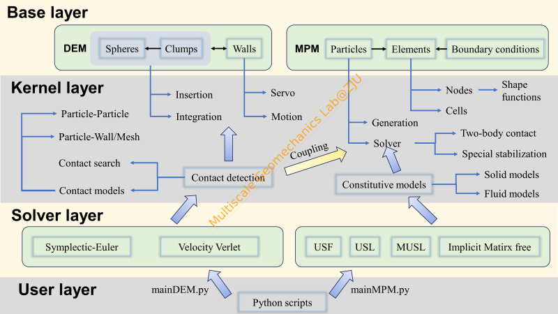
</p>

GeoTaichi is a research project that is currently __under development__. Our vision is to share with the geotechnical community a free, open-source (under the GPL-3.0 License) software that facilitates the relevant computational research. In the Taichi ecosystem, we hope to emphasize the potential of Taichi for scientific computing. Furthermore, GeoTaichi is high parallelized, multi-platform (supporting for Windows, Linux and Macs) and multi-architecture (supporting for both CPU and GPU).

## Examples

Have a cool example? Submit a [PR](https://github.com/Yihao-Shi/GeoTaichi/pulls)!

### [Material point method (MPM)](src/mpm/README.md#mpm-theory-log)
#### Explicit MPM
| [Column collapse](example/mpm/ColumnCollapse/DPmaterial.py) | [Dam break](example/mpm/ColumnCollapse/NewtonianFluid.py) | [Strip footing](example/mpm/Footing/StripFootingTresca.py) | [Progressive failure process of sensitive clay](example/mpm/ColumnCollapse/SoftDP.py) |
| --- | --- | --- | --- |
| 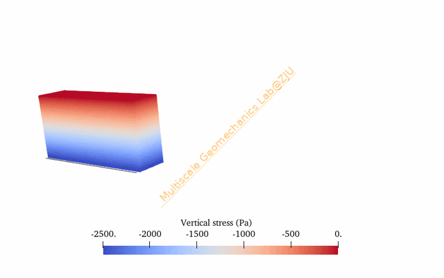 | 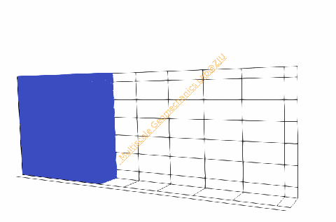 | 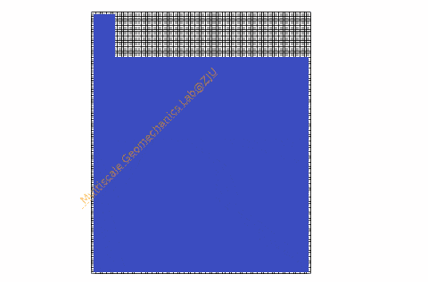 | 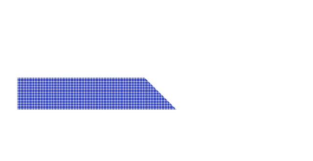 |

#### Semi-implicit incompressible MPM

| [Flow around a cylinder](examples/cfdem/FullyResolved/IBMFixedCylinder2D/cylinder_flow_ibm_2d.py) | [Lid-driven cavity (n64)](examples/mpm/IncompressibleFluid/lid_driven_cavity_2d.py) | [Taylor–Green vortex](examples/mpm/IncompressibleFluid/taylor_green_vortex_2d.py) |
| --- | --- | --- |
| 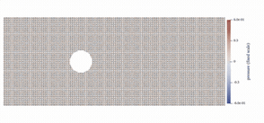 | 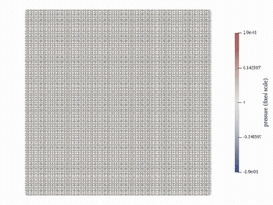 | 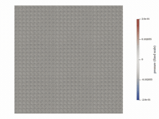 |

| [Dam break around a square obstacle](examples/mpm/IncompressibleFluid/dam_break_visible_sdf_2d.py) | [3D large-tank dam break](examples/mpm/IncompressibleFluid/large_tank_incompressible_3d.py) | [3D piston wavemaker](examples/mpm/IncompressibleFluid/wavemaker_tank_3d.py) |
| --- | --- | --- |
| 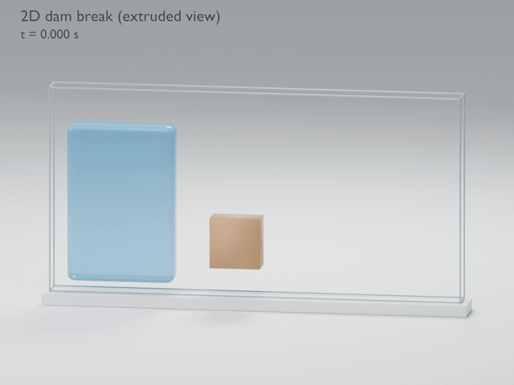 | 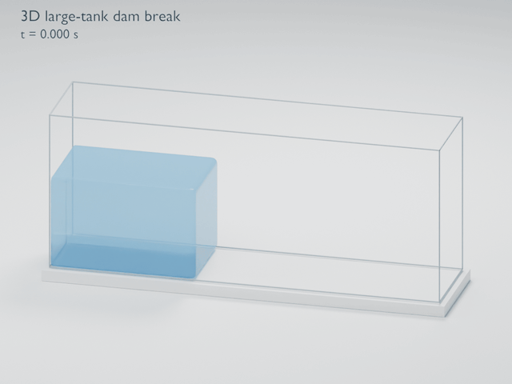 | 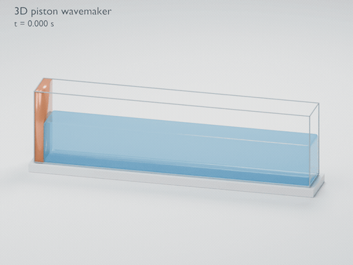 |

#### Two phase semi-implicit MPM

| [Dam break through a porous column](examples/mmpm/DamBreakPorousElastic2D/double_point_dam_break_porous_elastic.py) | [Submarine granular landslide](examples/mmpm/SubmarineLandslide/submarine_landslide_2d.py) | [U-tube flow through a porous bed](examples/mmpm/UTubeFlow2D/u_tube_flow_2d.py) |
| --- | --- | --- |
| 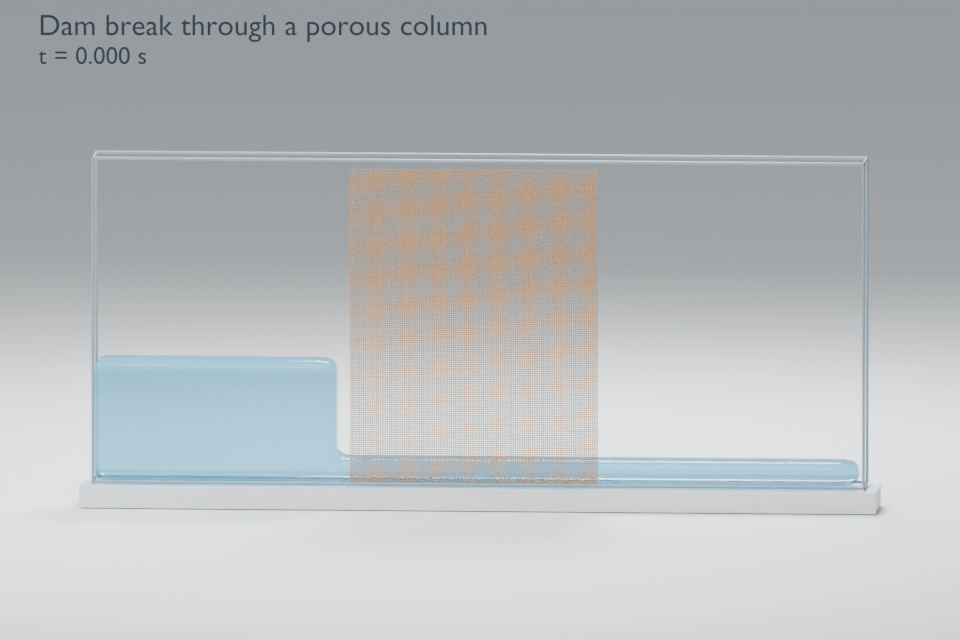 | 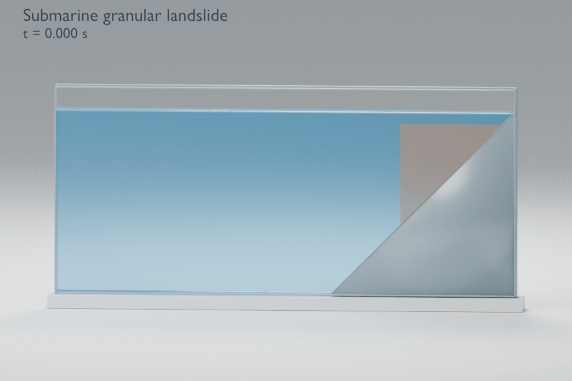 | 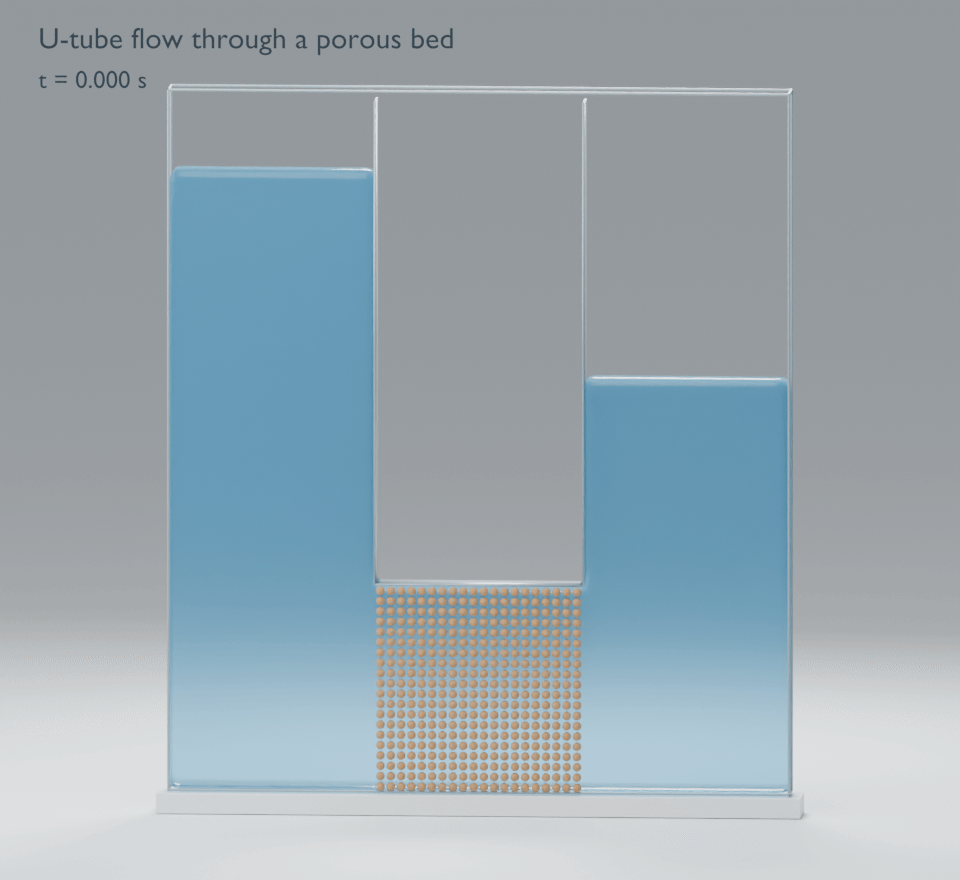 |

### [Discrete element method (DEM)](src/dem/README.md#dem-theory-log)
#### Explicit soft constraint
| [Granular packing](example/dem/GranularPackings/polyLevelSet/packing_generate.py) | [Screw and nut](example/dem/ParticleSliding/screw_and_nut.py) | [Debris Flow](example/dem/DebrisFlow) | 
| --- | --- | --- | 
| 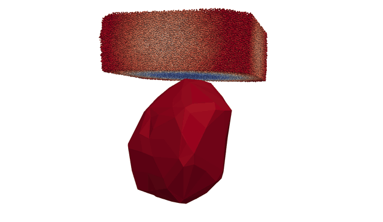 | 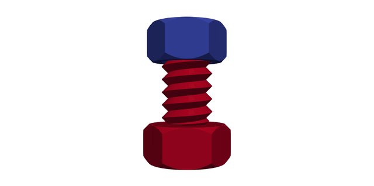 | 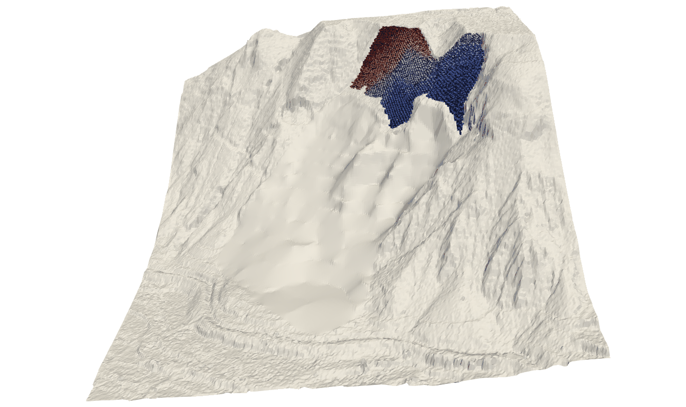 | 

|[Rotating drum](example/dem/RotatingDrums) | [Triaxial shear test](example/dem/TriaxialTest) |
| --- | --- | 
| 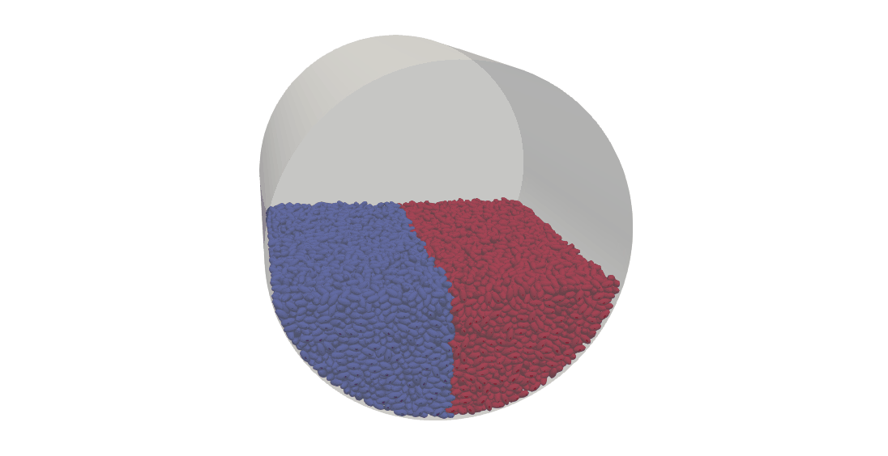 | 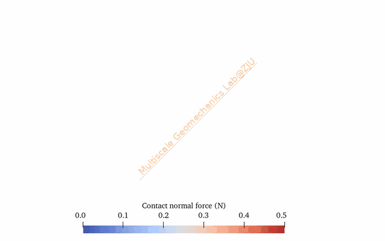 |
#### Implicit affine body dynamics (ABD)
Coming soon！

### [FEM](src/fem/README.md#fem-theory-log) / [IGA](src/iga/README.md#iga-theory-log)
Coming soon！

### [FEM-MPM](src/fempm/README.md#fem--mpm-coupling-theory-log) / [IGA-MPM](src/igampm/README.md#iga--mpm-coupling-theory-log)
#### Explicit soft constraint
Coming soon！

#### Incremental potential contact
Coming soon！

### [FEM-DEM](src/fedem/README.md#fedem-coupling-theory-log)
#### Explicit soft constraint
| [Hertz contact](examples/fedem/HertzContact/hertz_contact.py) | [Mixed funnel](examples/fedem/MixedFunnel/mixed_funnel.py) | [Isotropic compaction (100% soft grains)](examples/fedem/IsotropicCompaction/isotropic_compaction.py) |
| --- | --- | --- |
| 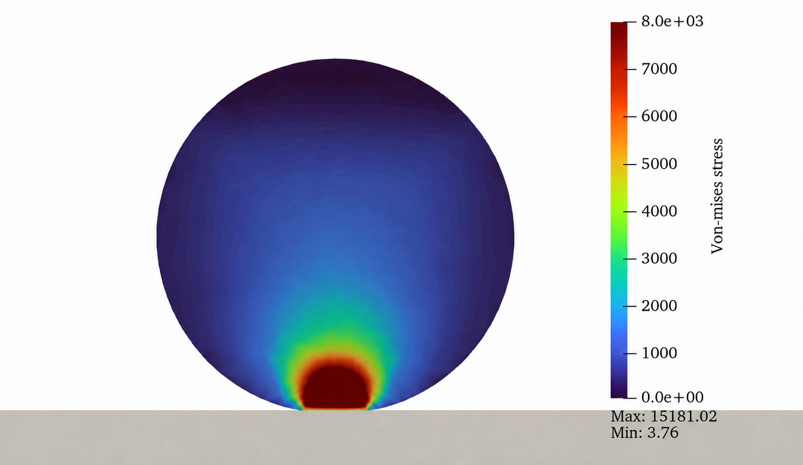 | 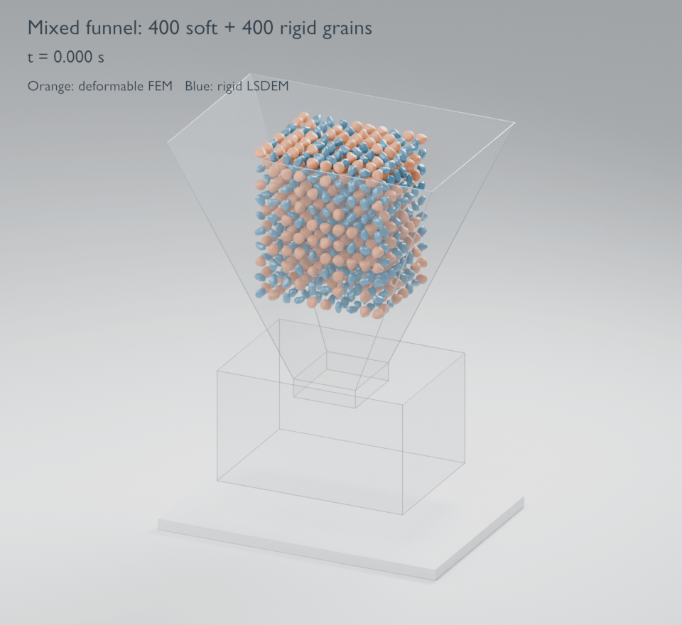 | 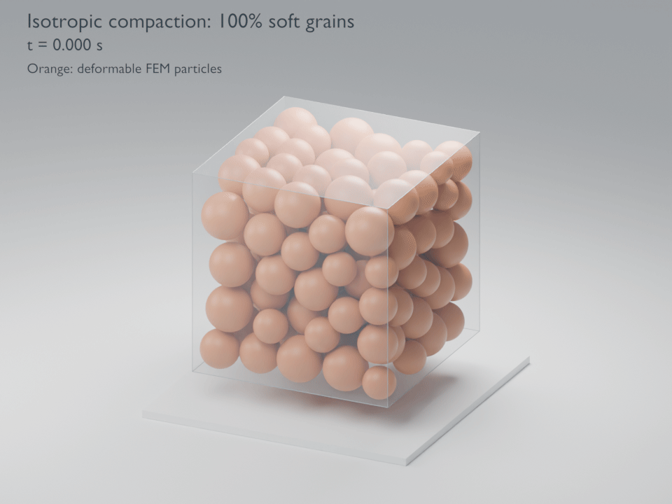 |

#### Incremental potential contact
Coming soon！

### [MPM-DEM](src/mpdem/README.md#mpdem-theory-log)
#### Explicit MPM-DEM
| [A sphere impacting granular bed](example/dempm/SphereImpact/plane_strain.py) | [Granular column impacting cubic particles](example/dempm/GranularImpact/granular_impact.py) | [Box sinking into water](example/dempm/BoxSinking/box.py) |
| --- | --- | --- |
| 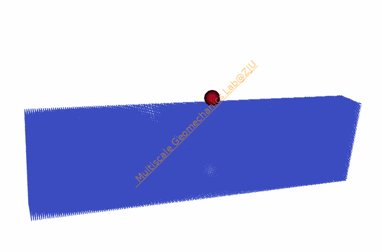 | 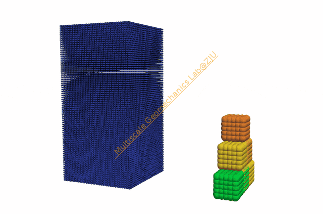 | 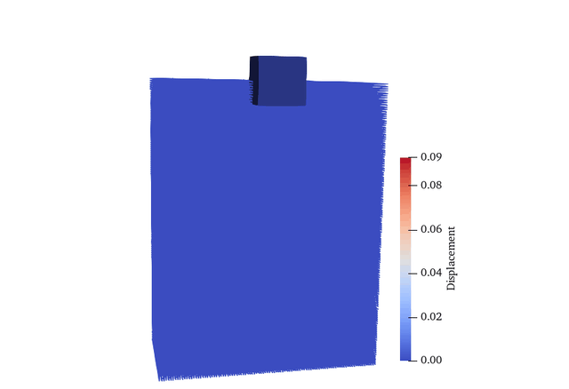 |

#### Immersed boundary method

| [Drafting, kissing and tumbling](examples/cfdem/FullyResolved/IBMDraftingKissingTumbling/drafting_kissing_tumbling.py) | [Sphere settling in oil](examples/cfdem/FullyResolved/IBMResolvedSphereSettling/sphere_settling.py) | [IBM dam break](examples/cfdem/FullyResolved/IBMLevelSetDamBreak3D/dam_break_levelset_ibm_3d.py) |
| --- | --- | --- |
| 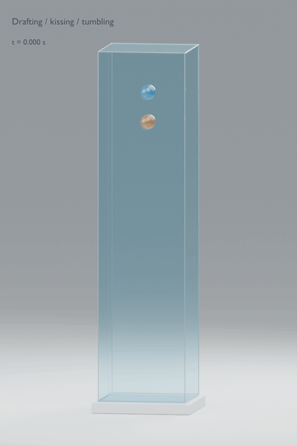 | 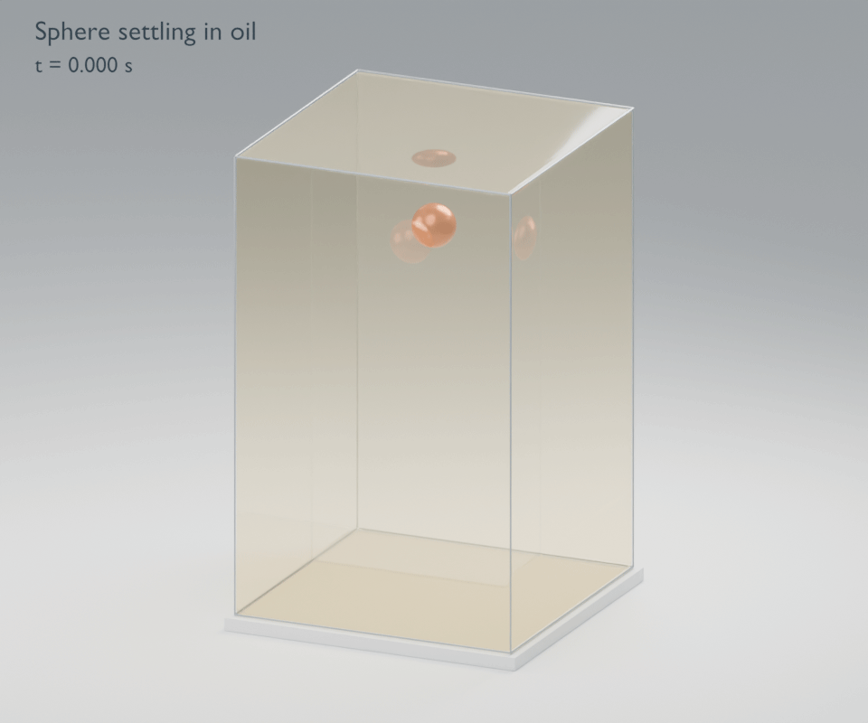 | 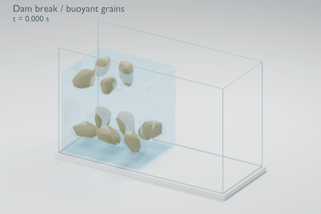 |
#### Incremental potential contact
Coming soon！

## Quick start
### Installation
#### Install from source code (recommand)
##### Ubuntu
1. Change the current working directory to the desired location and download the GeoTaichi code:
```
cd /path/to/desired/location/
git clone https://github.com/Yihao-Shi/GeoTaichi
cd GeoTaichi
```
2. Install essential dependencies
```
# Install python and pip
sudo apt-get install python3.8
sudo apt-get install python3-pip

# Install python packages (recommand to add package version)
bash requirements.sh
```
3. Install CUDA, detailed information can be referred to [official installation guide](https://docs.nvidia.com/cuda/cuda-installation-guide-linux/index.html)
4. Set up environment variables
```
sudo gedit ~/.bashrc
$ export PYTHONPATH="$PYTHONPATH:/path/to/desired/location/GeoTaichi"
source ~/.bashrc
```
##### Windows
1. Install Anaconda 
2. start Anaconda Prompt 
3. Navigate to a folder where geotaichi_env.yml is located. 
4. clone geotaichi as:
```
git clone https://github.com/Yihao-Shi/GeoTaichi 
```
5. run command:
```
conda env create -f geotaichi_env.yml 
```
6. run command:
```
conda activate geotaichi 
```
7. correct the environment (the last part should be modified to the path of geotaichi):
```
conda env config vars set PYTHONPATH=%PYTHONPATH%;.\path\to\GeoTaichi 
```
8. run command:
```
conda activate geotaichi 
```
9. run a benchmark (column collapse):
```
python DPmaterial 
```
Remark: line 3 of the examples should be modified based on the availability of the GPU. If CPU is available, the following should be used;
```
init('cpu')
```
#### Install from pip (easy)
```
pip install geotaichi
```

### Working with vtu files

To visualize the VTS files produced by some of the scripts, it is recommended to use [ParaView](http://www.paraview.org/). To visualize the output in ParaView, use the following
procedure:
1. Open the .vts or .vtu file in ParaView
2. Click on the "Apply" button on the left side of the screen
3. Make sure under "Representation" that "Surface" or "Surface with Edges" is selected
4. Under "Coloring" select variables and the approriate measure (i.e. "Magnitude", X-direction displacement, etc.)

### Document

Documentation is maintained alongside the source. Module READMEs describe supported formulations, theory logs, configuration, workflows, and limitations:

- Core solvers: [MPM](src/mpm/README.md#mpm-theory-log), [DEM](src/dem/README.md#dem-theory-log), [FEM](src/fem/README.md#fem-theory-log), and [IGA](src/iga/README.md#iga-theory-log).
- Coupled solvers: [MPM–DEM](src/mpdem/README.md#mpdem-theory-log), [FEM–DEM](src/fedem/README.md#fedem-coupling-theory-log), [FEM–MPM](src/fempm/README.md#fem--mpm-coupling-theory-log), and [IGA–MPM](src/igampm/README.md#iga--mpm-coupling-theory-log).
- Shared models and numerics: [Constitutive models](src/physics_model/consititutive_model/README.md), [Contact models](src/physics_model/contact_model/README.md), [Contact detection](src/contact_detection/README.md), and [Linear solvers](src/linear_solver/README.md).
- Usage and development: [Python examples](examples/), [Solver integration principles](docs/solver_integration_principles.md), [Blender add-on](blender/README.md), [Developer tools](tools/README.md), and [Tests and verification](tests/README.md).

Start with the README for your solver and a matching Python example. Additional derivations and technical notes are available in [docs](docs/helper/geotaichi_user_theory_manual.pdf).

## License
This project is licensed under the GNU General Public License v3 - see the [LICENSE](https://www.gnu.org/licenses/) for details.

## Citation
Please kindly star :star: this project if it helps you. We take great efforts to develope and maintain it :grin::grin:.

If you publish work that makes use of GeoTaichi, we would appreciate if you would cite the following reference:
```latex
@article{shi2024geotaichi,
  title={GeoTaichi: A Taichi-powered high-performance numerical simulator for multiscale geophysical problems},
  author={Shi, YH and Guo, N and Yang, ZX},
  journal={Computer Physics Communications},
  volume={301},
  pages={109219},
  year={2024},
  publisher={Elsevier}
}
@article{shi2025gpu,
  title={GPU-accelerated level-set DEM for arbitrarily shaped particles with broad size distributions},
  author={Shi, YH and Guo, N and Yang, ZX},
  journal={Powder Technology},
  pages={121293},
  year={2025},
  publisher={Elsevier}
}
```

## Acknowledgements
We thank all amazing contributors for their great work and open source spirit. We welcome all kinds of contributions to file an issue at [GitHub Issues](https://github.com/Yihao-Shi/GeoTaichi/issues).

### Contributors
<a href="https://github.com/Yihao-Shi/GeoTaichi/graphs/contributors">
  
</a>

### Contact us
- If you spot any issue or need any help, please mail directly to <a href = "mailto:shiyh@zju.edu.cn">shiyh@zju.edu.cn</a>.

## Release Notes
V0.5.0 (Oct 2, 2026)

- Please click [here](https://github.com/Yihao-Shi/GeoTaichi/releases/tag/GeoTaichi-v0.5) for more details

V0.4.0 (Aug 27, 2025)

- Please click [here](https://github.com/Yihao-Shi/GeoTaichi/releases/tag/GeoTaichi-v0.4) for more details

V0.3.0 (December 12, 2024)

- Please click [here](https://github.com/Yihao-Shi/GeoTaichi/releases/tag/GeoTaichi-v0.3) for more details

V0.2.2 (July 22, 2024)

- Fix computing the intersection area between circles and triangles
- Add "Destory" and "Reflect" boundaries in DEM modules, see [examples](https://github.com/Yihao-Shi/GeoTaichi/blob/main/example/dem/SimpleChute/simple_chute.py)

V0.2 (July 1, 2024)

- Fix some bugs in DEM and MPM modules, see [details](https://github.com/Yihao-Shi/GeoTaichi/releases/tag/GeoTaichi-v0.2)
- Add some advanced constitutive model

V0.1 (January 21, 2024)

- First release GeoTaichi
